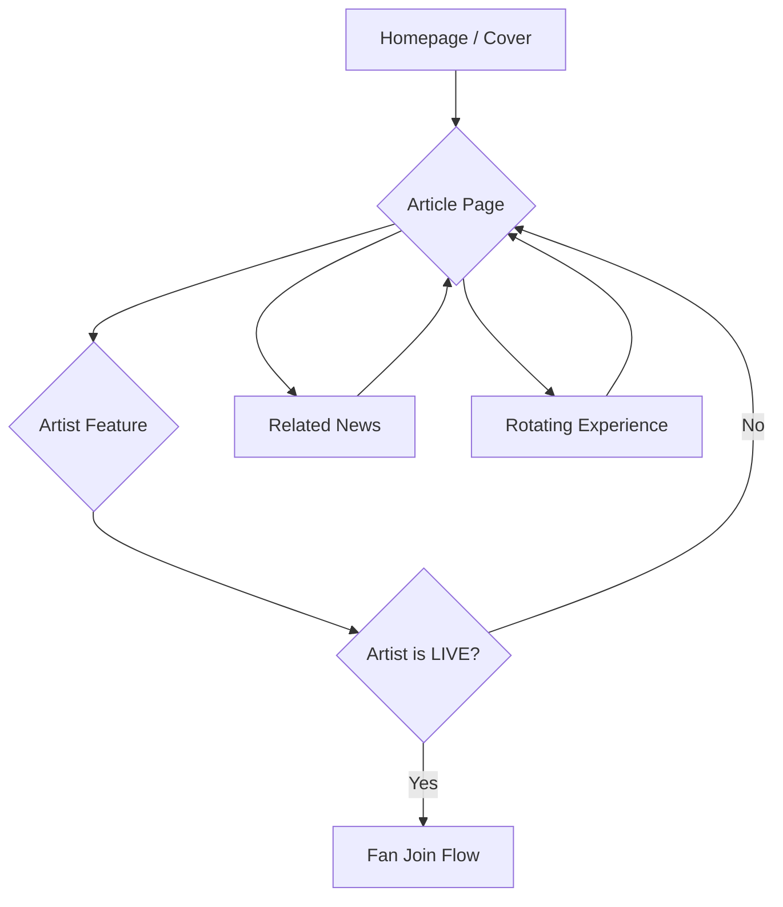
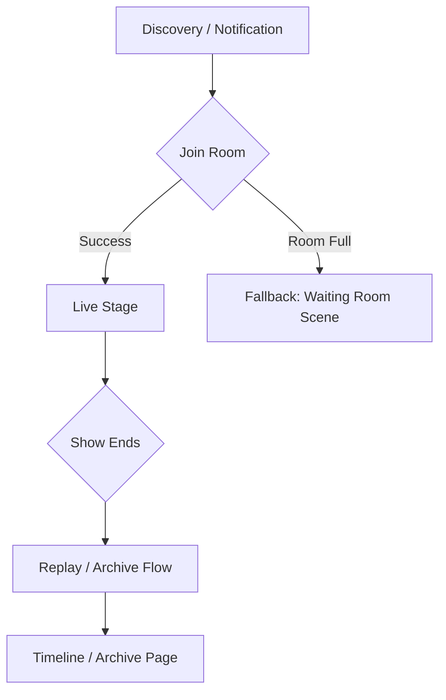
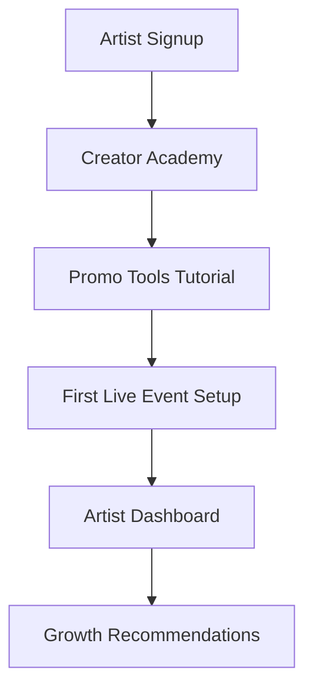
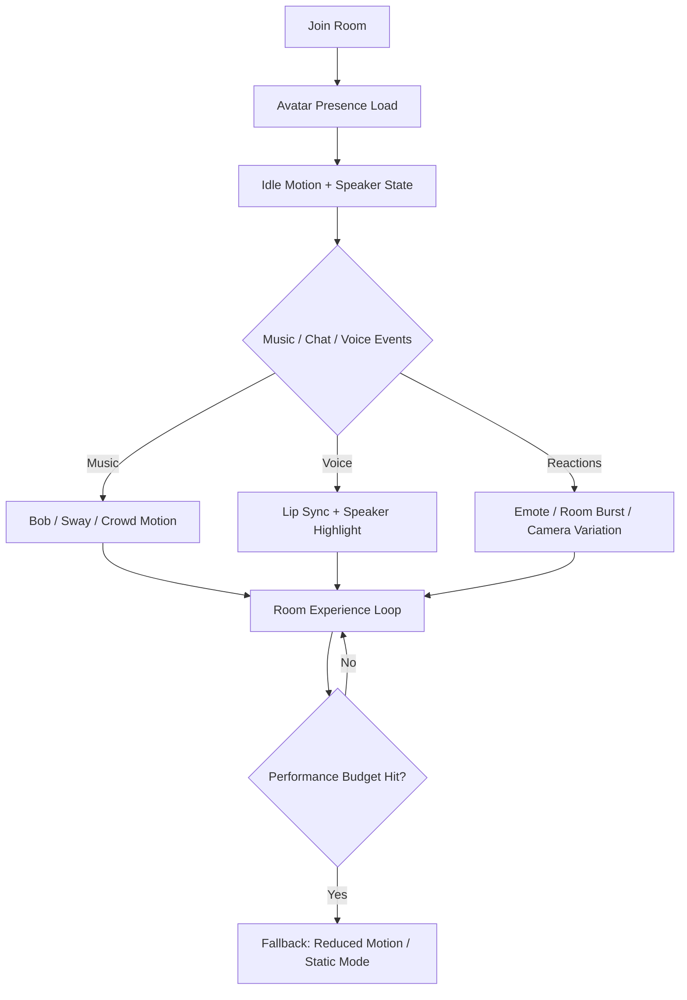
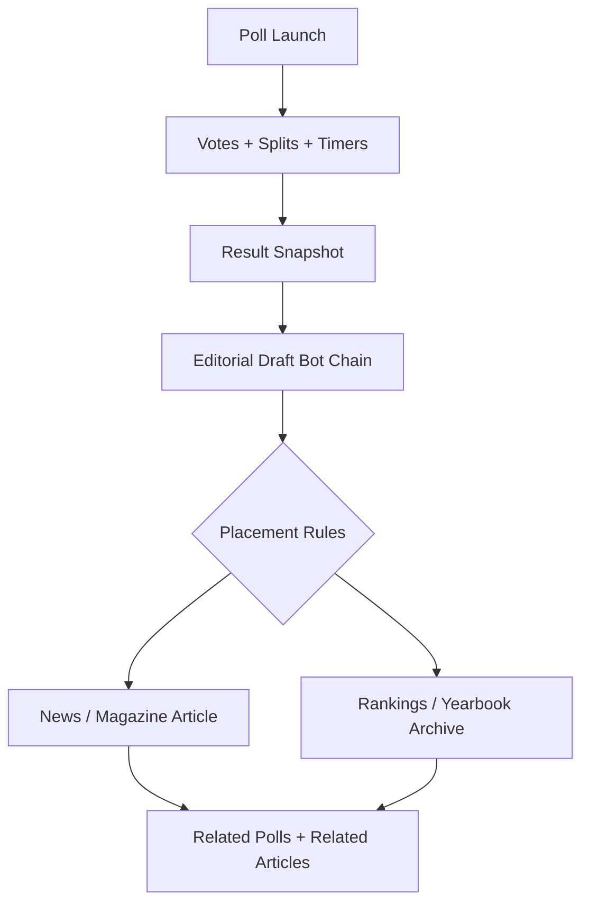
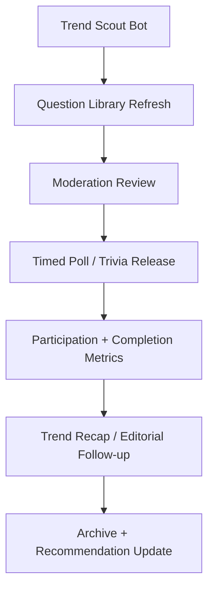

# Page Flow Map

**Purpose:** To define and lock the intended user navigation paths (chains) through the platform's modules. This ensures a cohesive user journey and prevents dead ends.

**Universal Completion Rule:** No major module is complete unless it has a route, scene, script, asset/animation/expression mapping, bot chain, fallback state, and validation coverage.

---

## 1. Public Magazine & Discovery Flow

**Owner:** `content-team`
**Build Priority:** P1

*   **Chain:** `Homepage -> Article -> Artist -> Join Live Room OR -> Related Article`
*   **Key Logic:** The `RealtimeEngine` must intercept the `Artist Feature` page load if the artist is live and redirect to the `Fan Join Flow`.

## 2. Fan Join & Replay Flow

**Owner:** `community-team`
**Build Priority:** P0

*   **Chain:** `Notification -> Join Room -> Live Stage -> Show End -> Archive Page`
*   **Key Logic:** The `SceneEngine` must handle the `Room Full` state by loading the `Waiting Room` fallback scene, not showing an error.

## 3. Creator Academy & Onboarding Flow

**Owner:** `artist-relations`
**Build Priority:** P1

*   **Chain:** `Signup -> Academy -> Tools -> First Live -> Dashboard`
*   **Key Logic:** The `StateEngine` must track tutorial completion to unlock features in the `Artist Dashboard`.

## 4. Live Room Avatar Presence Flow

**Owner:** `experience-team`
**Build Priority:** P0

*   **Chain:** `Join Room -> Presence Load -> Motion / Voice / Reaction Loop -> Performance Fallback`
*   **Key Logic:** The motion engine must respect accessibility settings, anti-spam caps, and the high/medium/low performance ladder before rendering full room effects.

## 5. Poll To Editorial Magazine Flow

**Owner:** `editorial-systems`
**Build Priority:** P0

*   **Chain:** `Poll -> Snapshot -> Editorial Draft -> Placement -> Article / Archive -> Recirculation`
*   **Key Logic:** Important polls are incomplete until they can generate an editorial result story and route into the correct magazine lane.

## 6. Live Trends Poll And Trivia Refresh Flow

**Owner:** `content-intelligence`
**Build Priority:** P1

*   **Chain:** `Trend Ingestion -> Question Refresh -> Review -> Release -> Metrics -> Editorial Recap`
*   **Key Logic:** The freshness engine must prevent current-year polls and trivia from becoming stale by combining weekly trend pulls, moderation review, and archive retirement rules.